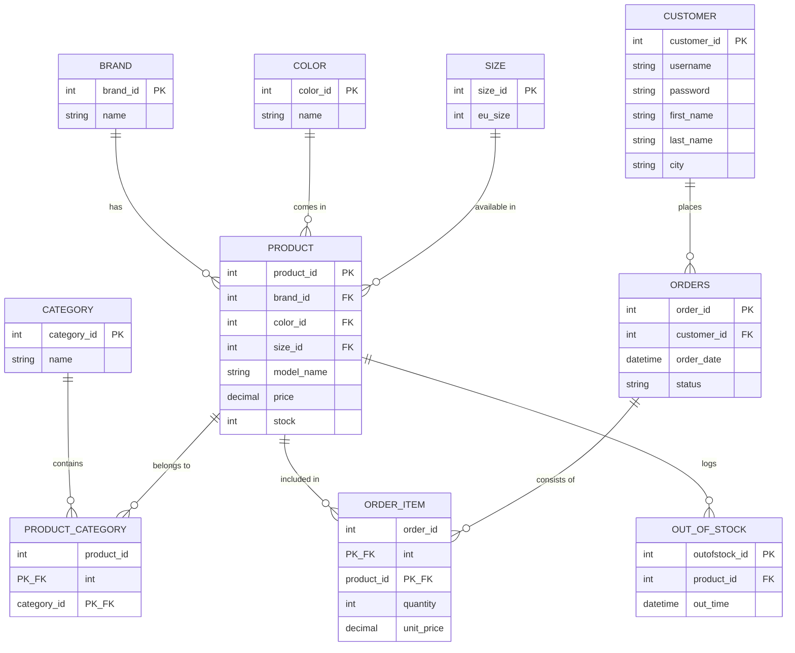

# My Shoe Store App 

A Java-based console application for managing a shoe store relying on a SQL database backend.

## Features
- **User Authentication**: Secure login for customers.
- **Product Browsing**: View available shoes with current stock.
- **Shopping Cart**: Add items to cart via database stored procedures.

## Database Mockup

## Requirements
- Java Development Kit (JDK) 21
- PostgreSQL / MySQL Database (configure in `.env`)
- IntelliJ IDEA (recommended)

## Setup
1. Clone the repository.
2. Configure your database connection in `.env`.
3. Run `src/Main.java`.
